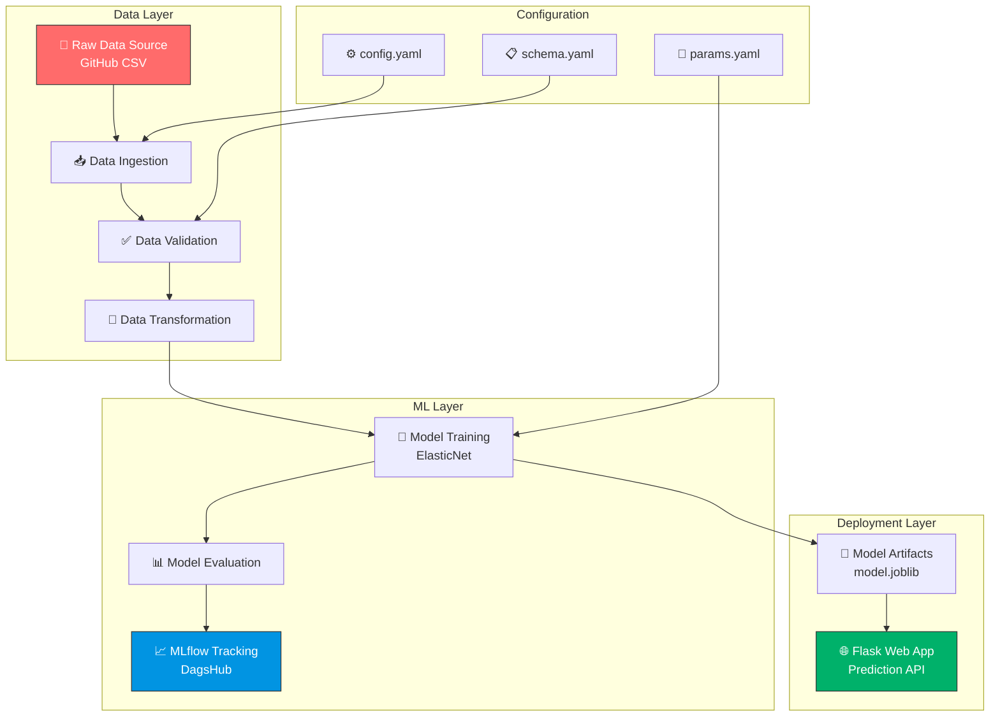
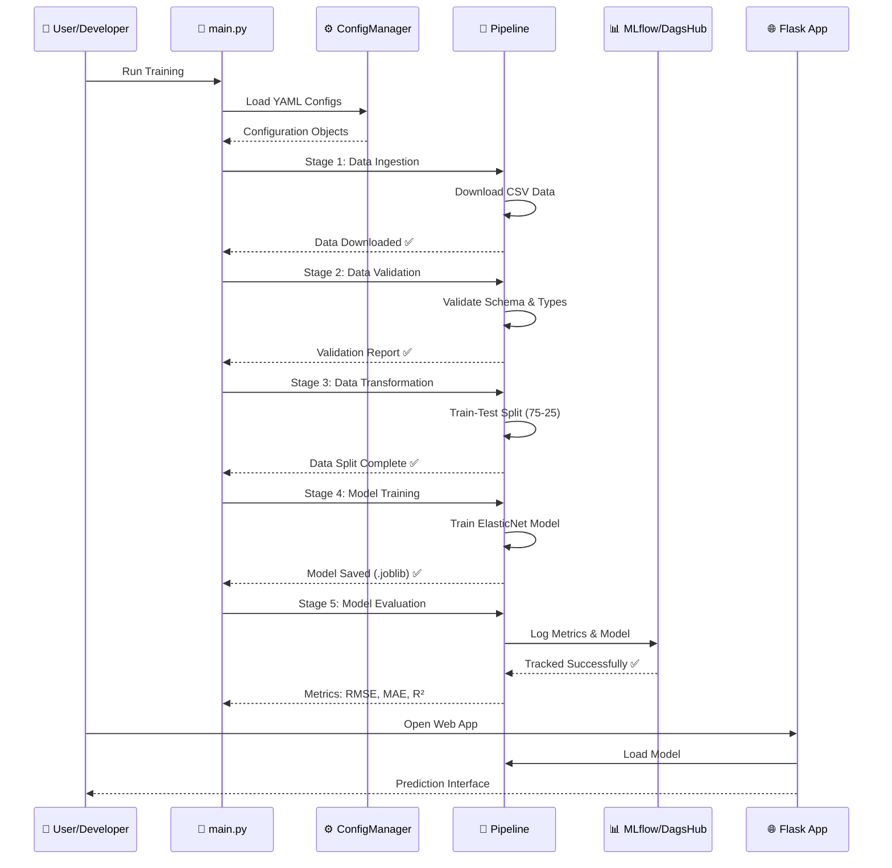
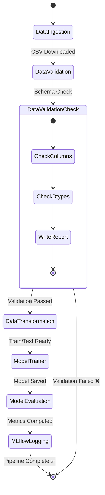
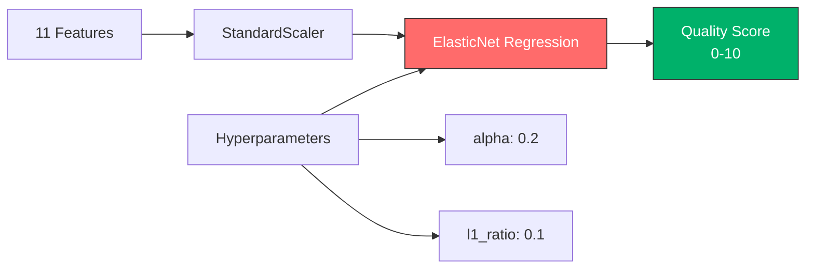
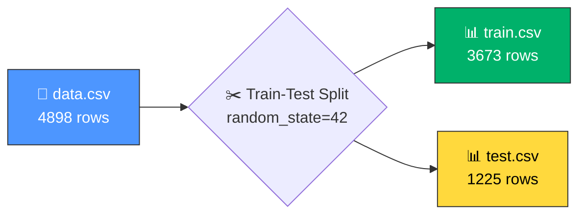
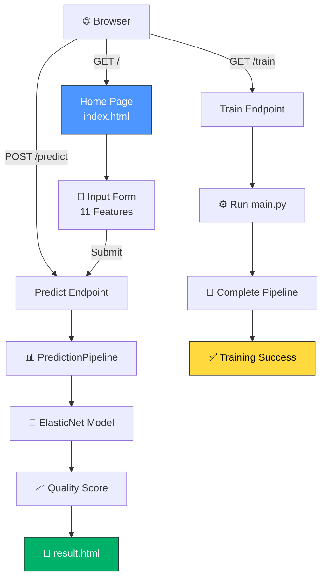
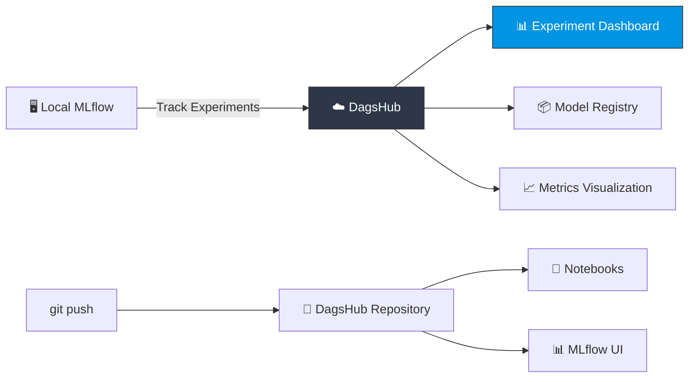
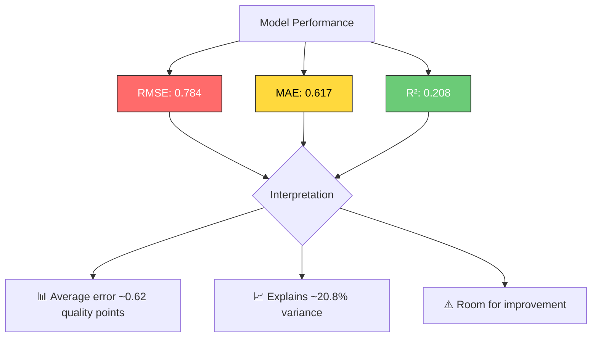
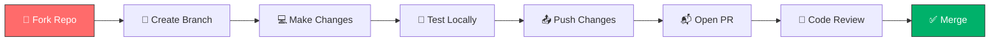

<!-- Auto-generated README using AI RAG -->
<!-- Generated on: 2026-04-26T06:05:01.184Z -->

<div align="center">

# 🍷 Wine Quality Prediction - MLOps Pipeline

[](https://www.python.org/)
[](https://flask.palletsprojects.com/)
[](https://mlflow.org/)
[](https://scikit-learn.org/)
[](https://dagshub.com/)
[](https://scikit-learn.org/stable/modules/generated/sklearn.linear_model.ElasticNet.html)
[](https://pandas.pydata.org/)
[](https://numpy.org/)

<br/>

<p align="center">
  
  
  
  
</p>

<h3>🎯 End-to-End MLOps Pipeline for Wine Quality Prediction with MLflow Tracking & Flask Deployment</h3>

<br/>

</div>

---

## 📑 Table of Contents

- [🍷 Overview](#-overview)
- [✨ Key Features](#-key-features)
- [🏗️ MLOps Architecture](#-mlops-architecture)
- [📊 ML Pipeline](#-ml-pipeline)
- [📁 Project Structure](#-project-structure)
- [🔬 Data Science Workflow](#-data-science-workflow)
- [🔄 Training Pipeline Stages](#-training-pipeline-stages)
- [🌐 Web Application](#-web-application)
- [📈 MLflow Tracking](#-mlflow-tracking)
- [📊 Model Performance](#-model-performance)
- [🚀 Quick Start](#-quick-start)
- [🐳 Docker Setup](#-docker-setup)
- [🧪 Research Notebooks](#-research-notebooks)
- [📋 Configuration Files](#-configuration-files)
- [🛠️ Troubleshooting](#-troubleshooting)
- [🤝 Contributing](#-contributing)
- [📄 License](#-license)
- [👨‍💻 Author](#-author)

---

## 🍷 Overview

This project implements a **complete MLOps pipeline** for predicting wine quality using machine learning. It demonstrates industry-standard practices including:

- **Modular Code Architecture** with proper project structure
- **Automated Data Pipelines** (Ingestion → Validation → Transformation → Training → Evaluation)
- **MLflow Experiment Tracking** integrated with DagsHub
- **Flask Web Application** for real-time predictions
- **Configuration Management** using YAML files
- **Logging & Monitoring** throughout the pipeline

### Business Problem

Predict wine quality on a scale of 0-10 based on 11 physicochemical properties:
- Fixed Acidity, Volatile Acidity, Citric Acid
- Residual Sugar, Chlorides, Free/Total Sulfur Dioxide
- Density, pH, Sulphates, Alcohol

---

## ✨ Key Features

<div align="center">

| Category | Feature | Description |
|----------|---------|-------------|
| 🔄 **Pipeline** | Modular ML Pipeline | 5-stage automated training pipeline |
| 📊 **Tracking** | MLflow Integration | Experiment tracking & model versioning |
| 🌐 **Deployment** | Flask Web App | Beautiful UI for real-time predictions |
| ✅ **Validation** | Data Validation | Automatic schema & dtype validation |
| 📈 **Monitoring** | Logging System | Comprehensive logging at every stage |
| ⚙️ **Config** | YAML Configuration | Centralized config management |
| 🐳 **Container** | Docker Ready | Dockerfile for containerization |
| 📓 **Research** | Jupyter Notebooks | 5 research notebooks documenting process |

</div>

---

## 🏗️ MLOps Architecture



### System Design Flow



---

## 📊 ML Pipeline

### Pipeline Stages Overview

```mermaid
graph LR
    A[1️⃣ Data<br/>Ingestion] -->|Raw CSV| B[2️⃣ Data<br/>Validation]
    B -->|Validated Data| C[3️⃣ Data<br/>Transformation]
    C -->|Train/Test Split| D[4️⃣ Model<br/>Trainer]
    D -->|Trained Model| E[5️⃣ Model<br/>Evaluation]
    E -->|Metrics + MLflow| F[📊 DagsHub<br/>Dashboard]
    
    style A fill:#FF6B6B,stroke:#333,color:#fff
    style B fill:#FFD93D,stroke:#333,color:#000
    style C fill:#6BCB77,stroke:#333,color:#fff
    style D fill:#4D96FF,stroke:#333,color:#fff
    style E fill:#9B59B6,stroke:#333,color:#fff
    style F fill:#0194E2,stroke:#333,color:#fff
```



### Detailed Pipeline Dependencies



---

## 📁 Project Structure

```
📦 Wine-Quality-MLOps
├── 📂 .github/workflows/         # GitHub Actions CI/CD
│   └── .gitkeep
├── 📂 artifacts/                  # ML Pipeline Outputs
│   ├── 📂 data_ingestion/        # Raw downloaded data
│   │   └── data.csv             # Wine quality dataset (4898 samples)
│   ├── 📂 data_validation/      # Validation reports
│   │   └── status.txt           # Column/dtype validation report
│   ├── 📂 data_transformation/  # Train-test splits
│   │   ├── train.csv            # Training data (3673 samples)
│   │   └── test.csv             # Test data (1225 samples)
│   ├── 📂 model_trainer/        # Trained model artifacts
│   │   └── model.joblib         # Serialized ElasticNet model
│   └── 📂 model_evaluation/     # Performance metrics
│       └── metrics.json         # RMSE, MAE, R² scores
│
├── 📂 config/                    # Configuration files
│   └── config.yaml              # Pipeline configuration
│
├── 📂 logs/                      # Application logs
│   └── logging.log              # Training run logs
│
├── 📂 mlruns/                    # MLflow experiment tracking
│   └── 0/models/                # Registered model versions
│       ├── m-a7fa9e.../         # Model version 1
│       └── m-c88549.../         # Model version 2
│
├── 📂 research/                  # Jupyter research notebooks
│   ├── research.ipynb           # Initial research
│   ├── 1_data_ingestion.ipynb   # Data ingestion experiments
│   ├── 2_data_validation.ipynb  # Validation logic
│   ├── 3.data_transformation.ipynb # Transformation pipeline
│   ├── 4_model_trainer.ipynb    # Model training experiments
│   └── 5_model_evaluate.ipynb   # Evaluation experiments
│
├── 📂 src/DATA_SCIENCE_Project/  # Source code
│   ├── __init__.py              # Logger configuration
│   ├── 📂 components/            # ML components
│   │   ├── data_ingestion_components.py
│   │   ├── data_validation_components.py
│   │   ├── data_transformation_components.py
│   │   ├── model_trainer_component.py
│   │   └── model_evaluation_component.py
│   ├── 📂 config/               # Configuration management
│   │   └── configuration.py    # ConfigManager class
│   ├── 📂 constants/            # Path constants
│   │   └── __init__.py
│   ├── 📂 entity/               # Data classes
│   │   └── config_entity.py    # Configuration entities
│   ├── 📂 pipeline/             # Training pipelines
│   │   ├── data_ingestion_pipeline.py
│   │   ├── data_validation_pipeline.py
│   │   ├── data_transformation_pipeline.py
│   │   ├── model_trainer_pipeline.py
│   │   ├── model_evaluation_pipeline.py
│   │   └── prediction_pipeline.py
│   └── 📂 utils/                # Utility functions
│       └── helper.py            # YAML/JSON/Model utilities
│
├── 📂 templates/                 # Flask HTML templates
│   ├── index.html              # Prediction input form
│   └── result.html             # Prediction results display
│
├── 📄 app.py                    # Flask web application
├── 📄 main.py                   # Training pipeline orchestrator
├── 📄 params.yaml               # Model hyperparameters
├── 📄 schema.yaml               # Data schema definition
├── 📄 requirements.txt          # Python dependencies
├── 📄 Dockerfile                # Container configuration
├── 📄 .gitignore               # Git ignore rules
└── 📄 setup.py                  # Package setup
```

---

## 🔬 Data Science Workflow

### Dataset Information

| Property | Value |
|----------|-------|
| **Source** | [Wine Quality Dataset (UCI)](https://archive.ics.uci.edu/ml/datasets/wine+quality) |
| **Samples** | 4,898 white wine samples |
| **Features** | 11 physicochemical properties |
| **Target** | Quality score (0-10) |
| **Task** | Regression |
| **Train/Test Split** | 75% / 25% (Stratified) |

### Feature Details

| # | Feature | Description | Type |
|---|---------|-------------|------|
| 1 | `fixed acidity` | Primary acids in wine | float64 |
| 2 | `volatile acidity` | Gaseous acids (acetic acid) | float64 |
| 3 | `citric acid` | Citric acid content | float64 |
| 4 | `residual sugar` | Sugar left after fermentation | float64 |
| 5 | `chlorides` | Salt content | float64 |
| 6 | `free sulfur dioxide` | Antimicrobial agent | float64 |
| 7 | `total sulfur dioxide` | Total SO2 content | float64 |
| 8 | `density` | Mass per volume | float64 |
| 9 | `pH` | Acidity/Alkalinity measure | float64 |
| 10 | `sulphates` | Sulfur-based preservative | float64 |
| 11 | `alcohol` | Alcohol percentage | float64 |
| 🎯 | **quality** | **Wine quality score** | **int64** |

### Model Architecture



---

## 🔄 Training Pipeline Stages

### Stage 1: Data Ingestion

```python
STAGE_NAME = "Data Ingestion stage"
# Downloads wine quality CSV from GitHub
# Saves to artifacts/data_ingestion/data.csv
```


### Stage 2: Data Validation

```python
STAGE_NAME = "Data Validation stage"
# Validates 12 columns and their data types
# Generates status.txt report
```

**Validation Report:**
```
=== Data Validation Report ===

MATCHED: [fixed acidity] (float64) ✅
MATCHED: [volatile acidity] (float64) ✅
MATCHED: [citric acid] (float64) ✅
MATCHED: [residual sugar] (float64) ✅
MATCHED: [chlorides] (float64) ✅
MATCHED: [free sulfur dioxide] (float64) ✅
MATCHED: [total sulfur dioxide] (float64) ✅
MATCHED: [density] (float64) ✅
MATCHED: [pH] (float64) ✅
MATCHED: [sulphates] (float64) ✅
MATCHED: [alcohol] (float64) ✅
MATCHED: [quality] (int64) ✅

OVERALL VALIDATION STATUS: True
```

### Stage 3: Data Transformation

```python
STAGE_NAME = "Data Transformation stage"
# Splits data: 75% train, 25% test
# Removes ';' separator, saves as clean CSV
```



### Stage 4: Model Trainer

```python
STAGE_NAME = "Model Trainer stage"
# Trains ElasticNet with α=0.2, l1_ratio=0.1
# Saves model as model.joblib
```

### Stage 5: Model Evaluation

```python
STAGE_NAME = "MODEL EVALUATION"
# Computes RMSE, MAE, R² metrics
# Logs to MLflow on DagsHub
```

---

## 🌐 Web Application

### Flask App Structure



### API Endpoints

| Endpoint | Method | Description | Response |
|----------|--------|-------------|----------|
| `/` | GET | Home page with input form | `index.html` |
| `/predict` | POST | Make wine quality prediction | `result.html` with score |
| `/predict` | GET | Redirect to input form | `index.html` |
| `/train` | GET | Trigger full training pipeline | "Training Successful!" |

### Prediction Input Features

```
📝 Enter Wine Properties:

• Fixed Acidity (e.g., 7.0)
• Volatile Acidity (e.g., 0.27)
• Citric Acid (e.g., 0.36)
• Residual Sugar (e.g., 20.7)
• Chlorides (e.g., 0.045)
• Free Sulfur Dioxide (e.g., 45.0)
• Total Sulfur Dioxide (e.g., 170.0)
• Density (e.g., 1.001)
• pH (e.g., 3.0)
• Sulphates (e.g., 0.45)
• Alcohol (e.g., 8.8)
```

---

## 📈 MLflow Tracking

### DagsHub Integration



### Tracked Metrics

| Run | RMSE | MAE | R² |
|-----|------|-----|----|
| Model v1 | - | - | - |
| Model v2 | 0.7840 | 0.6170 | 0.2082 |

### MLflow Artifacts Saved

```
mlruns/0/models/
├── m-a7fa9e6a6cc5407e8b3937e0c5a50a4f/
│   └── artifacts/
│       ├── model.pkl          # Serialized model
│       ├── MLmodel            # Model metadata
│       ├── conda.yaml         # Conda environment
│       ├── python_env.yaml    # Python environment
│       └── requirements.txt   # Dependencies
└── m-c88549994119469aa5102fd085057b42/
    └── artifacts/
        └── ... (same structure)
```

---

## 📊 Model Performance

### Evaluation Metrics

```json
{
    "RMSE": 0.7840071131848472,
    "MAE": 0.616962282942532,
    "R²": 0.2082492293886411
}
```

### Metrics Visualization



### Improvement Suggestions

- 🎯 Try other algorithms: Random Forest, XGBoost, LightGBM
- 🔧 Hyperparameter tuning with GridSearchCV/RandomizedSearchCV
- 📊 Feature engineering and selection
- 🧪 Cross-validation for robust evaluation
- 🎯 Try classification approach for quality categories

---

## 🚀 Quick Start

### Prerequisites

<div align="center">

| Tool | Version | Installation |
|------|---------|--------------|
|  | 3.10+ | [python.org](https://python.org) |
|  | 2.30+ | [git-scm.com](https://git-scm.com) |
|  | 3.11+ | `pip install mlflow` |

</div>

### Installation

#### 1. Clone Repository

```bash
git clone https://github.com/yourusername/Wine-Quality-Data-Science-Projects-MLOPS-.git
cd Wine-Quality-Data-Science-Projects-MLOPS-
```

#### 2. Create Virtual Environment

```bash
# Windows
python -m venv venv
venv\Scripts\activate

# Linux/Mac
python3 -m venv venv
source venv/bin/activate
```

#### 3. Install Dependencies

```bash
pip install --upgrade pip
pip install -r requirements.txt
```

#### 4. Run Full Training Pipeline

```bash
# Run the complete ML pipeline
python main.py
```

**Expected Output:**
```
[INFO] >>>>>> stage Data Ingestion stage started <<<<<<
[INFO] Pipeline Ran Successfully ✅😭
[INFO] >>>>>> stage Data Ingestion stage completed <<<<<<

[INFO] >>>>>> stage Data Validation stage started <<<<<<
[INFO] Pipeline Ran Successfully ✅😭
[INFO] >>>>>> stage Data Validation stage completed <<<<<<

[INFO] >>>>>> stage Data Transformation stage started <<<<<<
[INFO] Pipeline Ran Successfully ✅😭
[INFO] >>>>>> stage Data Transformation stage completed <<<<<<

[INFO] >>>>>> stage Model Trainer stage started <<<<<<
[INFO] Pipeline Ran Successfully ✅😭
[INFO] >>>>>> stage Model Trainer stage completed <<<<<<

[INFO] >>>>>> stage MODEL EVALUATION started <<<<<<
[INFO] Pipeline Ran Successfully ✅😭
[INFO] >>>>>> stage MODEL EVALUATION completed <<<<<<
```

#### 5. Launch Flask Web App

```bash
python app.py
```

Open your browser at: **`http://localhost:8080`**

#### 6. Make Predictions

1. Enter wine properties in the form
2. Click "Predict"
3. View the quality score

**OR trigger training from web:**
```bash
http://localhost:8080/train
```

---

## 🐳 Docker Setup

### Build Docker Image

```bash
# Build the image
docker build -t wine-quality-app:latest .

# Verify image
docker images | grep wine-quality
```

### Run Container

```bash
# Run container with port mapping
docker run -d -p 8080:8080 --name wine-predictor wine-quality-app:latest

# Check status
docker ps

# View logs
docker logs wine-predictor

# Stop container
docker stop wine-predictor

# Remove container
docker rm wine-predictor
```

### Docker Commands Cheat Sheet

| Command | Description |
|---------|-------------|
| `docker build -t name .` | Build Docker image |
| `docker run -d -p 8080:8080 name` | Run in background |
| `docker ps` | List containers |
| `docker logs name` | View logs |
| `docker exec -it name bash` | Enter container shell |
| `docker stop name` | Stop container |
| `docker rm name` | Remove container |
| `docker rmi name` | Remove image |

---

## 📋 Configuration Files

### `config.yaml` - Pipeline Configuration

```yaml
artifacts_root: artifacts

data_ingestion:
  root_dir: artifacts/data_ingestion
  source_URL: https://raw.githubusercontent.com/.../winequality-white.csv
  local_data_files: artifacts/data_ingestion/data.csv

data_validation:
  root_dir: artifacts/data_validation
  STATUS_FILE: artifacts/data_validation/status.txt

data_transformation:
  root_dir: artifacts/data_transformation

model_trainer:
  root_dir: artifacts/model_trainer
  model_name: model.joblib

model_evaluation:
  root_dir: artifacts/model_evaluation
  metric_file_path: artifacts/model_evaluation/metrics.json
```

### `schema.yaml` - Data Schema

```yaml
COLUMNS:
  fixed acidity: float64
  volatile acidity: float64
  citric acid: float64
  residual sugar: float64
  chlorides: float64
  free sulfur dioxide: float64
  total sulfur dioxide: float64
  density: float64
  pH: float64
  sulphates: float64
  alcohol: float64
  quality: int64

TARGET_COLUMN:
  name: "quality"
```

### `params.yaml` - Model Hyperparameters

```yaml
ElasticNet:
  alpha: 0.2
  l1_ratio: 0.1
```

---

## 🧪 Research Notebooks

The `research/` folder contains Jupyter notebooks documenting the development process:

| Notebook | Description | Key Experiments |
|----------|-------------|-----------------|
| `research.ipynb` | Initial exploration | Project setup, imports |
| `1_data_ingestion.ipynb` | Data download pipeline | URL fetching, file management |
| `2_data_validation.ipynb` | Schema validation | Column checks, dtype validation |
| `3.data_transformation.ipynb` | Data splitting | Train-test split, CSV handling |
| `4_model_trainer.ipynb` | Model training | ElasticNet training, joblib save |
| `5_model_evaluate.ipynb` | Model evaluation | Metrics, MLflow logging |

### Running Notebooks

```bash
# Start Jupyter
jupyter notebook

# Navigate to research/ folder
# Open any notebook and run cells
```

---

## 🛠️ Troubleshooting

<details>
<summary><b>🔴 Data Ingestion Fails</b></summary>

**Problem**: Cannot download CSV file

**Solutions**:
```bash
# Check internet connection
ping github.com

# Verify URL in config.yaml is accessible
curl -I https://raw.githubusercontent.com/.../winequality-white.csv

# Manually download
wget https://raw.githubusercontent.com/.../winequality-white.csv
# Move to artifacts/data_ingestion/
```
</details>

<details>
<summary><b>🔴 Validation Errors</b></summary>

**Problem**: Schema validation fails

**Solutions**:
```bash
# Check data.csv column names
python -c "import pandas as pd; print(pd.read_csv('artifacts/data_ingestion/data.csv', sep=';').columns.tolist())"

# Verify schema.yaml matches data
# Clear validation status
rm artifacts/data_validation/status.txt
```
</details>

<details>
<summary><b>🔴 MLflow Connection Issues</b></summary>

**Problem**: Cannot connect to DagsHub MLflow

**Solutions**:
```bash
# Set MLflow tracking URI
export MLFLOW_TRACKING_URI=https://dagshub.com/yourusername/repo.mlflow

# Or update in configuration.py
self.mlflow_uri = "https://dagshub.com/yourusername/repo.mlflow"

# Test connection
mlflow experiments list
```
</details>

<details>
<summary><b>🔴 Port Already in Use</b></summary>

**Problem**: Flask app won't start (port 8080)

**Solutions**:
```bash
# Windows - Find and kill process
netstat -ano | findstr :8080
taskkill /PID <PID> /F

# Linux/Mac
lsof -i :8080
kill -9 <PID>

# Or change port in app.py
app.run(host="0.0.0.0", port=5000)
```
</details>

---

## 🤝 Contributing

We welcome contributions! Here's how:

### Contribution Workflow



### Steps

1. Fork the repository
2. Create feature branch: `git checkout -b feature/amazing-idea`
3. Commit changes: `git commit -m "✨ Add amazing feature"`
4. Push: `git push origin feature/amazing-idea`
5. Open Pull Request

---

## 📄 License

<div align="center">

[](https://opensource.org/licenses/MIT)

This project is licensed under the MIT License.

</div>

---

## 👨‍💻 Author

<div align="center">

**Sahil Kumar**

[](https://github.com/sahilkumarrock8084)
[](https://dagshub.com/sahilkumarrock8084)

</div>

---

## 🌟 Acknowledgments

- 📊 [UCI Machine Learning Repository](https://archive.ics.uci.edu/) - Wine Quality Dataset
- 🤖 [scikit-learn](https://scikit-learn.org/) - ElasticNet Implementation
- 📈 [MLflow](https://mlflow.org/) - Experiment Tracking
- ☁️ [DagsHub](https://dagshub.com/) - MLflow Hosting
- 🌐 [Flask](https://flask.palletsprojects.com/) - Web Framework
- 📓 [Jupyter](https://jupyter.org/) - Research Environment

---

## 🎯 Future Improvements

- [ ] Add hyperparameter tuning (Optuna/Hyperopt)
- [ ] Implement cross-validation
- [ ] Add more models (XGBoost, LightGBM, Random Forest)
- [ ] Feature importance analysis
- [ ] Model A/B testing framework
- [ ] API documentation with Swagger
- [ ] Unit tests with pytest
- [ ] CI/CD pipeline with GitHub Actions
- [ ] Model serving with FastAPI
- [ ] Data drift monitoring

---

<div align="center">

### 🍷 **Cheers to Data Science & MLOps!** 🚀

[](https://github.com/sahilkumarrock8084)
[](https://github.com/sahilkumarrock8084)

<br/>

**⭐ Don't forget to star this repo if you found it useful! ⭐**
